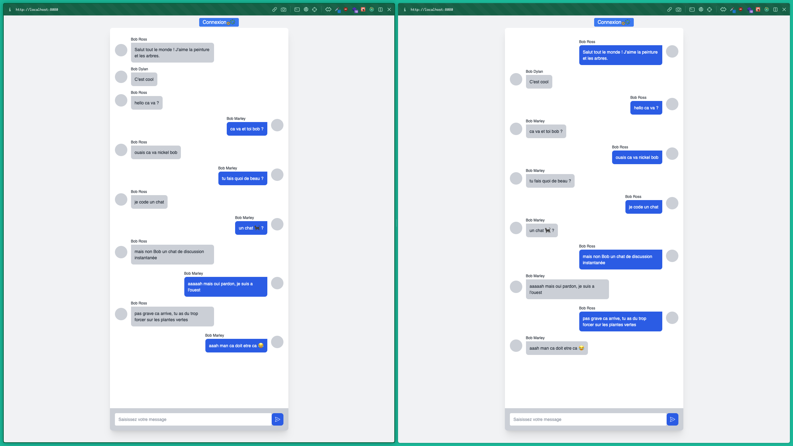

# Chatroom



**Chatroom** est une application web de messagerie instantannée, alimentée par Express pour l'API, React pour le front-end et WebSocket pour une expérience de messagerie instantanée.

### Étape 1: Installation des dépendances

Assurez-vous d'avoir Node.js et Yarn installés sur votre système.

Dans le dossier de l'API, exécutez la commande suivante pour installer les dépendances :

```
yarn install
```

Dans le dossier Front, exécutez également la commande suivante pour installer les dépendances :

```
yarn install
```

### Étape 2: Démarrage de l'API

1. Ouvrez une fenêtre de terminal et accédez au dossier de l'API.
2. Exécutez la commande suivante pour démarrer l'API :

```
yarn start
```

### Étape 3: Démarrage de l'application front

1. Ouvrez une autre fenêtre de terminal et accédez au dossier Front.
2. Exécutez la commande suivante pour démarrer l'application front :

```
yarn start
```

### Étape 4: Utilisation du chat

1. Ouvrez votre navigateur et accédez à l'URL <http://localhost:8080> (ou une autre URL indiquée dans votre application front).
2. Connectez-vous avec l'un des deux utilisateurs prédéfinis suivants :

   - Utilisateur 1 :

     Nom d'utilisateur : Bob Ross

     Email : `bob@ross.com`

     Mot de passe : `trees`

   - Utilisateur 2 :

     Nom d'utilisateur : Bob Marley

     Email : `bob@marley.com`

     Mot de passe : `trees`

3. Ouvrez un nouvel onglet du navigateur et connectez-vous avec un autre compte parmi les deux utilisateurs prédéfinis.
4. Vous pouvez maintenant discuter avec les deux comptes distincts. Veuillez noter que, bien que vous puissiez vous parler à vous-même, vous pouvez également engager une conversation entre les deux comptes.

Veuillez noter que ce code ne gère pas les aspects de sécurité tels que l'authentification et l'autorisation de manière robuste. Ce guide est destiné uniquement à des fins de développement et de démonstration.

Amusez-vous bien en utilisant votre chat !
